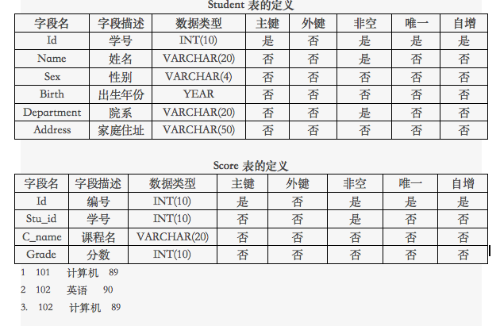

### 查询同时参加计算机和英语考试的学生的信息

1.创建student和score表

 ```
 CREATE TABLE if NOT EXISTS student(
id int(10) PRIMARY key not null auto_increment,
name VARCHAR(20) NOT NUll, 
sex VARCHAR(4),
birth year,
department VARCHAR(20),
Address VARCHAR(50)
);

CREATE TABLE if not EXISTS score(
id int(10) PRIMARY key not null auto_increment,
stu_id int(10) not null,
c_name VARCHAR(20),
grade int(10)
);
 ```
2.为student表和score表增加记录
 
 ```
 INSERT into student VALUES
(01,'zahngsan','male',1999,'english','hunan'),
(02,'zahngsi' ,'male', 1998,'computer','sichuan'),
(03,'lisi','male',1993, 'engilsh', 'hunan'),
(04,'wangwu','male',1994,'computer','hunan'),
(05,'liu', 'male',2000, 'computer','bejing');

INSERT into score VALUES
(01,01,'com',85),
(02,01,'eng',85),
(03,02,'com',90),
(04,03,'com',96),
(05,04,'eng',68),
(06,05,'com',88);
 ```

3.查询student表的所有记录
 
 ```
 select * from student
 ```

4.查询student表的第2条到4条记录
 
 ```
 select * FROM student WHERE id>=2 and id<=4;
 SELECT * FROM student LIMIT 1,3;
 ```

5.从student表查询所有学生的学号（id）、姓名（name）和院系（department）的信息 
 
 ```
 SELECT id,name,department FROM student;
 ```
6.从student表中查询计算机系和英语系的学生的信息

 ```
 SELECT * FROM student WHERE department='english' or department='computer';
 ```

7.从student表中查询年龄18~22岁的学生信息  
 
 ```
 SELECT * FROM student WHERE YEAR(CURDATE())-birth>=18 and YEAR(CURDATE())-birth<=22;
 ```
8.从student表中查询每个院系有多少人 
 
 ```
 SELECT COUNT(department) from student WHERE department='computer';
 SELECT COUNT(department) as english_num from student WHERE department='english';
 
 SELECT department,count(department) as number FROM student GROUP BY department;
 ```
10.查询李四的考试科目（c_name）和考试成绩（grade）

 ```
 SELECT c_name,grade from score WHERE stu_id=03;
 SELECT c_name,grade from score WHERE stu_id=(SELECT id from student WHERE name ='lisi');
 SELECT b.c_name,b.grade FROM student as a JOIN score as b on a.id = b.stu_id WHERE a.name = 'lisi'; 
 ```
11.用连接的方式查询所有学生的信息和考试信息
 
 ```
 SELECT * FROM student JOIN score on student.id = score.stu_id;
 ```

12.计算每个学生的总成绩
  
  ```
  SELECT name,SUM(grade) FROM student JOIN score ON student.id = score.stu_id GROUP BY student.id;
  ```
13.计算每个考试科目的平均成绩

 ```
 SELECT b.c_name,avg(grade) FROM student as a JOIN score as b  ON a.id = b.stu_id GROUP BY b.c_name;
 SELECT score.c_name,avg(grade) FROM student JOIN score ON student.id = score.stu_id GROUP BY score.c_name;
 ```
14.查询计算机成绩低于95的学生信息
 
 ```
 SELECT a.* FROM student as a join score as b on a.id = b.stu_id AND b.grade <95 WHERE b.c_name='com';
 ```
15.查询同时参加计算机和英语考试的学生的信息
 
 ```
 select * from student where id in (

 select stu_id from score where c_name ='com' and stu_id in(

 select stu_id from score where c_name ='eng'));
 
 ```
16.将计算机考试成绩按从高到低进行排序
 
 ```
 SELECT grade as com_grade from score WHERE c_name = 'com' ORDER BY grade desc; 
 ```

18.查询姓张或者姓王的同学的姓名、院系和考试科目及成绩
 
 ```
 SELECT a.name,a.department,b.c_name,b.grade FROM student as a join score as b on a.id = b.stu_id WHERE a.name like 'wang%' or a.name like 'zahng%';
 ```

19.查询都是湖南的学生的姓名、年龄、院系和考试科目及成绩
 
 ```
 SELECT a.name,(YEAR(CURDATE())-a.birth) as age,a.department,b.c_name,b.grade FROM student as a join score as b on a.id = b.stu_id WHERE a.Address='hunan';
 ```

20.把张三的姓名改为张三丰，课程改为java 分数100
 
 ```
 UPDATE student JOIN score on student.id = score.stu_id set name = 'zhangsanfeng',c_name='java',grade = 100 WHERE name = 'zahngsan';

 ```
   
 