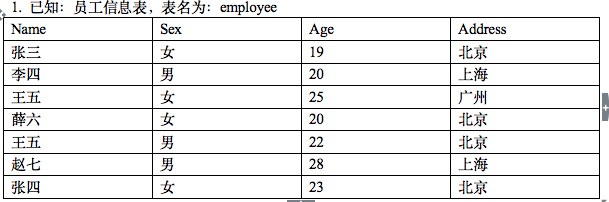

（1）. 写出sql语句，查询所有年龄大于20岁的员工（2分）
 
 ```
 SELECT * FROM employee WHERE age > 20;
 ```

（2）. 写出sql语句，查询所有年龄小于25岁的女性员工（3分）
 
 ```
 SELECT * FROM employee WHERE age < 25 and sex = '女';
 ```
（3）. 写出sql语句，统计男女员工各有多少名（3分）
 
 ```
 SELECT sex,COUNT(sex) as numb FROM employee GROUP BY sex;

 ```
（4）. 写出sql语句，按照年龄倒序获取员工信息（3分）
 
 ```
 SELECT * FROM employee ORDER BY age desc;
 ```
（5）. 写出sql语句，获取员工中哪个姓名具有重名现象（3分）
 
 ```
 SELECT name FROM employee GROUP BY name HAVING COUNT(name) > 1;
 ```
（6）. 写出sql语句，查询所有姓张的员工（3分）
 
 ```
 SELECT * FROM employee WHERE name LIKE '张%';
 ```
（7）. 写出sql语句，查询住址为北京的前3条记录（3分）

 ```
 SELECT * FROM employee WHERE Address = '北京' LIMIT 0,3;
 ```
（8）. 写出sql语句，查询员工总数（3分）

 ```
 SELECT COUNT(*) as total_num FROM employee;
 ```
（9）. 写出sql语句，向表中插入一条记录（2分）
 
 ```
 INSERT into employee VALUES(8,'刘四','女',27,'北京');
 insert into employee (`sex`,`name`,`age`) values (`男`,`李宁`,`35`);
 ```
（10）.写出sql语句，修改员工张四的住址为南京（2分）
 
 ```
 UPDATE employee set Address = '南京' WHERE name = '张四';
 ```
（11）.写出sql语句，删除年龄大于24岁的女员工（2分）
 
 ```
 DELETE FROM employee WHERE age > 24 and sex = '女';
 ```