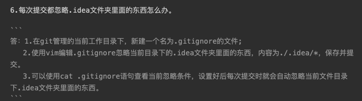
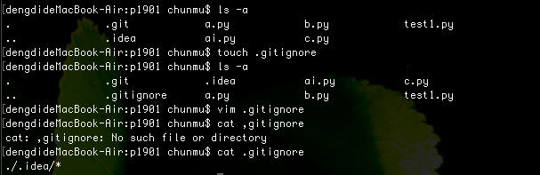

#### 1. git add和git stage的区别是什么
两者无区别，用法完全相同

#### 2. git rm --cached 和git rm -f的区别是什么
删除暂存区或分支上的文件, 但本地又需要使用, 只是不希望这个文件被版本控制

git rm --cached  让被跟踪的文件不在被跟踪

删除暂存区或分支上的文件, 同时工作区也不需要这个文件了

git rm -f   删除文件

#### 3. git和svn的区别是什么

1. GIT是分布式的，SVN是集中式
2. GIT把内容按元数据方式存储，而SVN是按文件
3. GIT分支和SVN的分支不同
4. GIT没有一个全局的版本号，而SVN有
5. GIT的内容完整性要优于SVN

#### 4. 筛选出 2018.10.1 到 2018.10.20之间的日志,并且输出为地理图,并且没有做过合并
```
git log --since=2018-10-1 --before=2018-10-20 --no--merges --graph
```
#### 5. git init和git clone的区别
git init 仅仅是按照既有的结构框架初始化好了里边所有的文件和目录，但我们还没有开始跟踪管理项目中的任何一个文件

git clone 别人的项目历史的所有数据（每一个文件的每一个版本），服务器上有的数据克隆之后本地也都有了。

#### 6. 每次提交都忽略.idea文件夹里面的东西怎么办
1、在git管理的当前文件下创建一个.gitignore文件
2、使用vim在文件中输入条件限制  eg：./.idea/*
注意：若要忽略已经被跟踪的文件，则需要先使用git rm --cached 使其不被跟踪




#### 7. 如果编辑一个文件之后并且加入了暂存区,但是你后悔了,想把文件恢复到没有修改之前的样子,怎么办

git reset HEAD test.py
git checkout test.py
#### 8. 如何检出标签?
git tag
git tag 标签号
#### 9. git fetch 和 git pull的区别
git pull == git fetch + git merge

#### 10. 如何添加远程仓库
git remote add 'name' addr