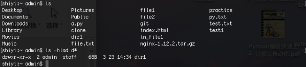
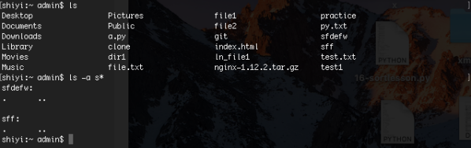
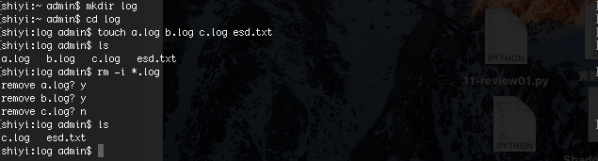
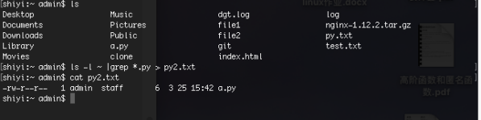
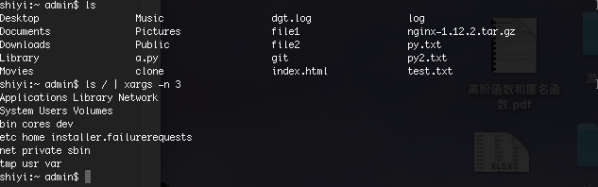
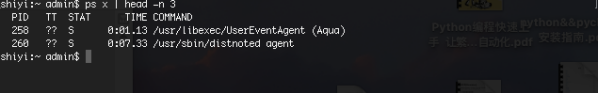

##### 1、以容易理解的格式列出/home 目录中所有以”d”开头的文件目录的大小

```
ls -lhda d*
find ~ -name 'r*' -exec ls -lh {} \
```



##### 2、列出/home 目录中所有以”s”开头的目录。
```
ls -a s*
find ~ -name 'r*' -type d -exec ls -lh {} \
```



##### 3、删除后缀名为.log 的所有，删除前逐一询问
```
rm -i *.log
find ~ -name '*.log' -exec rm -ri {} \
```



##### 4、cp 命令 —n 和 -u的区别
man cp

-u 复制时只复制文件夹里不一样的内容，相同内容相当于覆盖

-n 复制时遇到相同内容不会覆盖

##### 5、找你的用户目录下面的所有py文件,ls -l 查看他们的属性,然后把这些结果输入到一个文件之中 
```
ls -l ~ | grep *.py > file.txt
find ~ -name '*.py' -type f -exec ls -l {} \; > res.txt
```



##### 6、使用ls查看根目录 并且每行显示3个信息
```
ls / | xargs -n 3
```



##### 7、查看所有进程信息,只查看前3行
```
ps x | head -n 3
ps -ef | head -n 3
```



##### 8、分析以下问题,并给出解决方案

```
Mount is denied because the NTFS volume is already exclusively opened.
The volume may be already mounted, or another software may use it which could be identified for example by the help of the 'fuser' command.
```


挂载失败是由于NTFS已经被打开执行，此时需使用fuser命令查找出正在使用的进程，用kill命令将其关闭后重新mount即可

##### 9、ssh 服务端口是多少,ssh免密登录方式的原理是什么
默认为Port 22，实际使用中可以更改
ftp 20用于控制链接  21用于数据链接
首先用户通过keygen得到一堆公钥和私钥，用户将公钥储存到服务器授权列表上。当用户想链接服务器时，向服务器发出请求，服务器查看授权列表中是否有用户的公钥，若是有则随机生成一个字串用用户的公钥加密返回给用户，用户用私钥解密后返还给服务器，若返回字串与随机生成的字串相同则登录成功。由于中间不需要用户输入密码，所以是免密登录。

##### 10、权限755代表什么权限,如果我想把所有的w权限去除应该使用什么命令
```
权限755代表 rwxr-xr-x
chmod a-w file
```
