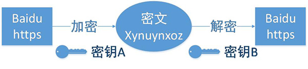

### 延时 吞吐量扥练习题

1. 一台分组交换机接收到一个分组并决定该分组应当转发的链路。当某分组到达时,另一个分组正在该出链路上被发送到一半,还有4个其他分组正在等待传输。这些分组以到达的次序传输。假定所有分组是1500bytes并且链路速率是2Mbps。该分组的排队时延时多少?

 ```
由题可知：  N * L = 4.5 * 1500 = 6750Bytes
因为  1Byte = 8bit    所以    NL = 6750Bytes  * 8 = 54000bit
所以排队时延为       NL/R = 54000/(2*10^6) = 27ms
```
2. 假定有N个分组同时到达一条当前没有分组传输或排队的链路。每个分组长为L,链路传输速率为R。对于N个分组而言,其平均排队时延时多少?

 ```
(N -1) * L / 2R
 ```
3. 接上题,现在假定每隔LN/R秒就有N个分组同时达到链路。一个分组的平均排队时延时多少?

 ```
 由于LN/R比(N - 1) * L / 2R大，所以在下一次N个分组来之前，上一次N个分组已经处理完了，
 没有额外排队时延，所以平均排队时延依然是(N - 1) * L / 2R
 ```
4. 考虑路由器缓存中的排队时延。忽略传播时延和处理时延。令I表示流量强度;I=La/R。假定排队时延的形势为 IL/R(1-I),其中 I<1。

 a.写出总时延公式

 b.令a表示在一条链路上分组的到达率(分组/秒 为单位),令u表示一条链路上分组的传输率(分组/秒)。基于上述公式写出以a和u表示的总延时公式
 
 ```
 IL/R(1-I)+L/R = L/(1-I)R
 
 ```

### 应用层练习

1. Http与Https的区别
 
 ```
 两者均为超文本传输协议，但是HTTPS是在HTTP上增加了SSL加密，所以更加安全
 两者端口也不同   HTTP/80    https/ 443
 ```
2. URI和URL的区别

 ```
 统一资源定位符(uniform resource locator URL)
 统一资源标识符(uniform resource identifier URI)
 1.URL是URI的一个特例，它包含了定位Web资源的足够信息,每个 URL 都是 URI，但不一定每个 URI 都是 URL
 2.URL的格式一般由下列三部分组成:
  第一部分是协议(或称为服务方式);第二部分是存有该资源的主机IP地址(有时也包括端口号);第三部分是主机资源的   具体地址
 URI一般由三部分组成:
 访问资源的命名机制。存放资源的主机名。资源自身的名称，由路径表示。 
 ```
3. HTTPS工作原理


4. 一次完整的HTTP请求所经历的7个步骤
 
 ```
  客户端在使用HTTPS方式与Web服务器通信时有以下几个步骤，如图所示。
　　（1）客户使用https的URL访问Web服务器，要求与Web服务器建立SSL连接。
　　（2）Web服务器收到客户端请求后，会将网站的证书信息（证书中包含公钥）传送一份给客户端。
　　（3）客户端的浏览器与Web服务器开始协商SSL连接的安全等级，也就是信息加密的等级。
　　（4）客户端的浏览器根据双方同意的安全等级，建立会话密钥，然后利用网站的公钥将会话密钥加密，并传送给网站
　　（5）Web服务器利用自己的私钥解密出会话密钥。
　　（6）Web服务器利用会话密钥加密与客户端之间的通信。
　　　　
 ```
 
 
5. 常见的HTTP相应状态码

 ```
HTTP状态码共分为5种类型：
1**	信息，服务器收到请求，需要请求者继续执行操作
2**	成功，操作被成功接收并处理
3**	重定向，需要进一步的操作以完成请求
4**	客户端错误，请求包含语法错误或无法完成请求
5**	服务器错误，服务器在处理请求的过程中发生了错误

 下面是常见的HTTP状态码：
 200 - 请求成功
 301 - 资源（网页等）被永久转移到其它URL
 404 - 请求的资源（网页等）不存在
 500 - 内部服务器错误

 ```
 
6. TCP协议和UDP协议的区别是什么
 
 ```
 TCP与UDP区别总结：

 1、TCP面向连接（如打电话要先拨号建立连接）;UDP是无连接的，即发送数据之前不需要建立连接
2、TCP提供可靠的服务。也就是说，通过TCP连接传送的数据，无差错，不丢失，不重复，且按序到达;UDP尽最大努力交付，即不保证可靠交付
Tcp通过校验和，重传控制，序号标识，滑动窗口、确认应答实现可靠传输。如丢包时的重发控制，还可以对次序乱掉的分包进行顺序控制。
3、UDP具有较好的实时性，工作效率比TCP高，适用于对高速传输和实时性有较高的通信或广播通信。
4.每一条TCP连接只能是点到点的;UDP支持一对一，一对多，多对一和多对多的交互通信
5、TCP对系统资源要求较多，UDP对系统资源要求较少。
 ```

7. TCP建立连接的过程采用三次握手，已知第三次握手报文的发送序列号为555，确认序列号为6666，请问第二次握手报文的发送序列号和确认序列号分别为？

 ```
 第三次握手报文发送序列号为第二次的确认序列号，则第二次的确认序列号为555，第三次的确认序列号为第二次的发送序列号加1，则第二次的发送序列号为6666 - 1 = 6665。
  ```
8. 简述tcp ip四层模型

 ```
 应用层、传输层、网络层、链路层
 ```
9. 简述 osi七层模型

 ```
 应用层、表示层、会话层、传输层、网络层、数据链路层、物理层
 ```
10. dns是什么 dns是哪一层协议

 ```
 域名系统（英文：DomainNameSystem，缩写：DNS）是互联网的一项服务，属于应用层。它作为将域名和IP地址相互映射的一个分布式数据库，能够使人更方便地访问互联网。
 
 ```
11. arp是哪一层协议

 ```
 ARP（Address Resolution Protocol）地址解析协议
 属于链路层
 ```
12. wifi是哪一层协议

 ```
 wifi是802.15和802.11的技术标准。802.11主要是针对局域网的相关标准。而局域网是工作在OSI数据链路层和物理层的。
 ```
13. 简述cdn作用 #运输层网络层练习题

 ```
 CDN的全称是Content Delivery Network，即内容分发网络。CDN是构建在网络之上的内容分发网络，依靠部署在各地的边缘服务器，通过中心平台的负载均衡、内容分发、调度等功能模块，使用户就近获取所需内容，降低网络拥塞，提高用户访问响应速度和命中率。CDN的关键技术主要有内容存储和分发技术。
 ```
14. 服务器发生close wait是在什么时候

 ```
 在被动关闭连接情况下，在已经接收到FIN，但是还没有发送自己的FIN的时刻，连接处于CLOSE_WAIT状态。
 
 ```
15. 简述syn洪攻击

 ```
 SYN攻击利用的是TCP的三次握手机制，攻击端利用伪造的IP地址向被攻击端（服务器或者主机）发出请求，而被攻击端发出的响应 报文将永远发送不到目的地，那么被攻击端在等待关闭这个连接的过程中消耗了资源，如果有成千上万的这种连接，主机资源将被耗尽，从而达到攻击的目的
 ```
16. 156.123.32.13 是哪一类ip地址

 ```
 B类
 ```
17. 主机ip地址为 193.32.5.22 掩码为 255.255.255.192 网络地址为多少,广播地址为多少

 ```
 193.32.5.22
 换成二进制为1100 0001.0010 0000.0000 0101.0001 0110
 
 255.255.255.192
 换成二进制为1111 1111.1111 1111.1111 1111.1100 0000
   
 两者进行与运算，得出网络地址为：    1100 0001.0010 0000.0000 0101.0000 0000，即193.32.5.0
 
 网络位之后的地址都取1，得出广播地址为1100 0001.0010 0000.0000 0101.0011 1111，即193.32.5.63
 ```
18. icmp是哪一层协议

 ```
 ICMP（Iterenet Control message Protocol 互联网控制消息协议）是网络层中的协议
 ```
19. get方法和post方法的不同

 ```
 1.区别在于一个修改资源和获取资源

 2.get可以用于保存收藏连接地址

  3.post请求可以把请求的内容放在报文里面
  
 4.GET方法，获取资源。请求参数附在地址栏后面，可见的；

 5.POST方法，传输实体主体。一般用于提交表单等操作，且表单的内容在地址栏是不可见的；
  
 ```
 
20. 简述DOS攻击 和DDOS攻击

 ```
 DoS是Denial of Service的简称，即拒绝服务，造成DoS的攻击行为被称为DoS攻击，其目的是使计算机或网络无法     提供正常的服务。最常见的DoS攻击有计算机网络带宽攻击和连通性攻击。 
 DoS攻击是指故意的攻击网络协议实现的缺陷或直接通过野蛮手段残忍地耗尽被攻击对象的资源，目的是让目标计算机或网络无法提供正常的服务或资源访问，使目标系统服务系统停止响应甚至崩溃，

 分布式拒绝服务(DDoS:Distributed Denial of Service)攻击指借助于客户/服务器技术，将多个计算机联合起来作为攻击平台，对一个或多个目标发动DDoS攻击，从而成倍地提高拒绝服务攻击的威力。
 ```
21. tcp报文头中,首部长度的作用是什么?首部长度是多少位?首部的位数为二进制表现方式,那么首部表现成十进制的最大数字是多少?tcp首部最大长度是多少,他和首都长度段有什么联系?tcp首部可选数据字段是多长?

 ```
 首部长度的作用：它指出TCP报文段的数据起始处距离TCP报文段的起始处有多远。首部长度占4位，可表示的最大十进制值是15，这个字段的单位是32位字(4字节)，所以当IP首部长度为1111(就是十进制15)，首部长度就达到最大值4 X 15 = 60字节,首部长度与首部长度段的关系为代表报文头数据偏移的值，因为选项长度固定占了20字节，则tcp首部可选数据字段最大为40字节。

 ```
22. tcp最大端口号是多少?为什么?linux系统能开启多少个端口，为什么？linux操作系统端口号和进程号的关系是什么?

 ```
 最大端口号为65535，因为tcp端口号在tcp报文头中声明的，端口号占用16bit，共最大可到达2^16 = 65536个端口,所以端口号取值0～65535。
   linux也是使用TCP/IP规范，则端口范围就是0-65535，其中全0没有意义，所以可用端口1-65535。
   linux操作系统端口号和进程号之间并没有什么必然的联系，只是进程通过端口来使用，在端口被相应进程使用时，可以使用端口号找到该进程，但端口号和进程号之间并没有直接关系。
 ```
23. tcp三次握手中 第三次握手首部中syn值是多少 为什么?

 ```
 第三次握手时syn=0。
   因为发送端发送一个SYN=1，ACK=0标志的数据包给接收端，请求进行连接，这是第一次握手；
   接收端收到请求并且允许连接的话，就会发送一个SYN=1，ACK=1标志的数据包给发送端，告诉它，可以通讯了，并且让发送端发送一个确认数据包，这是第二次握手；
   最后，发送端发送一个SYN=0，ACK=1的数据包给接收端，告诉它连接已被确认，这就是第三次握手。之后，一个TCP连接建立，开始通讯
 ```
24. tcp协议中 ISN是什么意思?ISN的值一定是1吗?BSD使用的ISN值的方案是什么?不同的连接ISN一样吗,如果不一样如何确定?（参考RFC 793）

 ```
 TCP连接的时候的系列号(ISN)
 不一定是1
     ISN = M + F(localhost, localport, remotehost, remoteport)
 ```
25. tcp协议中 序列号是如何增长的,是每次加1还是随机增长还是其他方式增长?第三次握手时 ack序列号是否增加 为什么?第一次握手响应时ack序列号加多少 为什么?

 ```
 每次增加1的方式增长
 第三次握手时序列号是第二次握手的确认号，故没有增加。
 第一次握手响应的ACK序列号不确定，因为是随机生成的。
 ```

26. mss是什么?mss在什么时候确定?tcp报文最大长度理论上是多少 为什么?实际上面是多少 为什么?

 ```
 MSS最大传输大小的缩写，是TCP协议里面的一个概念。MSS就是TCP数据包每次能够传输的最大数据分段。为了达到最佳的传输效能TCP协议在建立连接的时候通常要协商双方的MSS值，这个值TCP协议在实现的时候往往用MTU值代替（需要减去IP数据包包头的大小20Bytes和TCP数据段的包头20Bytes）, 通讯双方会根据双方提供的MSS值得最小值确定为这次连接的最大MSS值。而一般以太网MTU都为1500, 所以在以太网中, 往往TCPMSS为1460。
 ```
27. tcp最大长度是多少,为什么?

 ```
 链路层最多能承载65535长度的ip数据包(MTU)，IP头最少20个字节，TCP头最少也是20个字节。所以TCP报文段能携带的数据最多就是65535-20-20=65495B。
 ```
28. tcp窗口/mss大小如何确定,在什么时候,什么位置确定窗口/mss大小?

 ```
 
 ```
29. 如何理解tcp的半关闭(half-close)？什么是全双工?

 ```
 半关闭：tcp的半关闭状态发生在断开连接时的四次释放时，相当于客服端先向服务器发出断开连接请求后，服务器端第   一次做出回应后连接处于半关闭状态，此时客户端不再向服务器端发送报文，但是若服务端还有数据需要传输给客户端，  客户端仍然接收，当传输完成后，由服务端发送断开连接，待客户端确认后才完全断开连接。
 
 全双工：全双工（Full Duplex）是通讯传输的一个术语。通信允许数据在两个方向上同时传输，它在能力上相当 于两个单工通信方式的结合。全双工指可以同时（瞬时）进行信号的双向传输（A→B且B→A）。指A→B的同时B→A，是瞬时同步的。

 ```
30. 为什么握手需要三次?为什么关闭连接需要四次?

 ```
 TCP建立连接要进行3次握手,而断开连接要进行4次,这是由于TCP的半关闭造成的,因为TCP连接是全双工的(即数据可在两个方向上同时传递)所以进行关闭时每个方向上都要单独进行关闭,这个单方向的关闭就叫半关闭。关闭的方法是一方完成它的数据传输后,就发送一个FIN来向另一方通告将要终止这个方向的连接.当一端收到一个FIN,它必须通知应用层TCP连接已终止了这个方向的数据传送,发送FIN通常是应用层进行关闭的结果.
 ```
31. GBN的定时器有几个 SR的定时器有几个

 ```
 GBN：有发送方缓存，无接收方缓存，一个定时器（可认为最早的已发送但还未被确认的分组所使用的计时器），丢弃失序分组，采用累计确认。
   SR：有发送方缓存，有接收方缓存，每个分组都有定时器，缓存失序分组，不采用累计确认
 ```
32. 为什么说tcp协议是面向连接的?

 ```
 因为tcp协议需要收到信息返回建立了连接后才会进行传输，而udp则不需要
 ```
33. GBN协议中,接收方窗口大小是多少

 ```
 BSD中默认设置发送和接受缓冲区的大小为2048字节
 ```
34. GBN协议中,需要对大于当前期望收到的分组序号的序号做确认吗?SR中需要确认吗?

 ```
 GBN需要，SR不需要
 ```
35. TCP/IP的中文解释是什么?

 ```
 TCP:transmission Control Protocol传输控制协议
 IP:Internet Protocol互联网络协议
 ```
36. 假设链路层MTU为 1600 那么MSS最大为多少

 ```
 1600 - 20 - 20 = 1560
 ```
37. MSS指的是什么的大小

 ```
 MSS:Maximum Segment Size，最大报文长度
 ```
38. 计算机的端口为什么最大是65535

 ```
 因为在TCP协议中，在TCP报头中端口只用两个字节来存储。两字节最多只能编码0 ~ 2^16这么多的端口，即端口最大只能到65535。
 ```
39. a. 假定你有下列2个字节: 01011100和01100101。者两个字节之和的反码是什么?

 ```
 
 ```

  b.假定你有下列2个字节: 11011010和01100101这两个的反码和是多少?
  
  ```
  
  ```
  
  c. 1bit的差错将可能检测不出来吗?2bit呢?
  
  ```
  
  ```
  ```
  原码就是这个数本身的二进制形式
  正数的反码和补码都是和原码相同。
负数的反码是将其原码除符号位之外的各位求反
[-3]反=[10000011]反=11111100
负数的补码是将其原码除符号位之外的各位求反之后在末位再加1。
[-3]补=[10000011]补=11111101
  ```